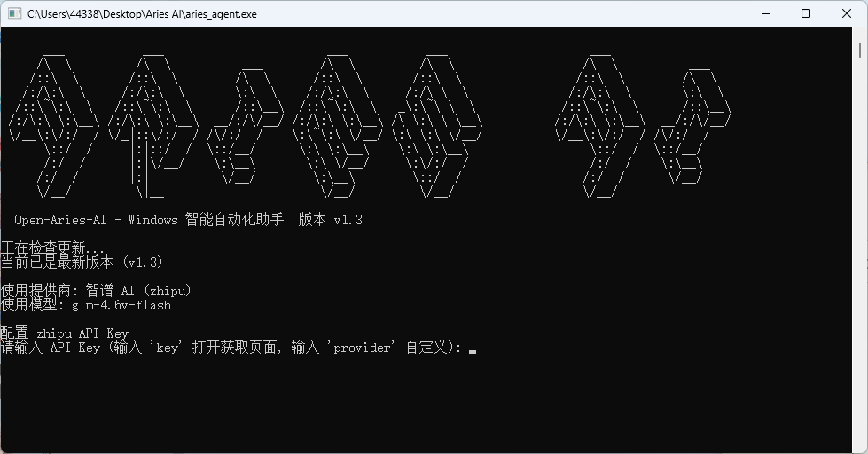
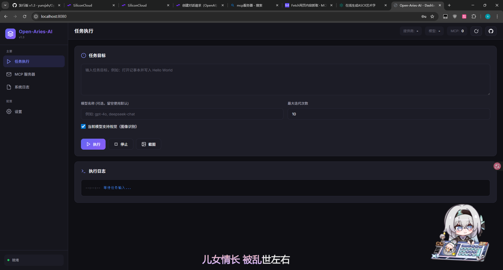

# Open-Aries-AI - Windows 智能自动化助手

[](https://openai.com/blog/openai-api)
[](https://www.microsoft.com/windows)
[](https://isocpp.org/)

Open-Aries-AI 是一个基于大语言模型的 Windows 桌面自动化助手。通过截图分析/控件树转述 + AI 决策 + 自动执行，实现自然语言控制电脑操作。

**核心优势**: 
- 支持视觉模型和纯文本模型（可配置视觉模型转述）
- 支持智谱 AI 和自定义 OpenAI 兼容 API，一键切换不同厂商模型
- 完整的 UI Automation 控件操作和窗口管理
- 支持中文输入和文件管理
- 完整的动作历史反馈机制

## 📸 界面截图

### 命令行版本


### Web GUI 版本


## 🌟 核心功能

| 功能 | 描述 |
|------|------|
| **🖼️ 视觉感知** | 自动截取屏幕，通过视觉模型分析当前界面状态 |
| **📝 纯文本模式** | 不支持视觉的模型可通过控件列表或视觉模型转述理解界面 |
| **🧠 智能决策** | AI 根据界面信息和用户指令，规划下一步操作 |
| **🤖 自动执行** | 模拟鼠标点击、键盘输入、滑动等操作 |
| **📱 应用管理** | 获取已安装应用列表，智能启动应用程序 |
| **📁 文件管理** | 完整的文件操作：读取、写入、搜索、执行文件（支持Unicode路径） |
| **🎮 UI Automation** | 获取控件树、点击控件、窗口操作（最小化/最大化/置顶等） |
| **💻 命令执行** | 通过 PowerShell 执行系统命令 |
| **🔒 安全存储** | DPAPI + 硬件绑定的双重加密存储 |
| **📝 中文支持** | 完美支持中文输入和文件路径 |
| **📊 动作历史** | 完整的动作历史记录和反馈，避免重复操作 |
| **🔄 智能总结** | 第5次迭代自动提示AI进行阶段性总结 |

## 📋 系统架构

```
┌─────────────────────────────────────────────────────────────────────┐
│                          Open-Aries-AI                              │
├─────────────┬─────────────┬─────────────┬───────────────────────────┤
│   视觉感知   │   AI 决策    │   动作执行   │        应用管理            │
│ (Screenshot)│ (LLM API)   │  (Action    │      (AppManager)         │
│   /控件树    │             │   Executor) │                           │
│   转述      │             │             │                           │
└─────────────┴─────────────┴─────────────┴───────────────────────────┘
       │              │              │              │
       ▼              ▼              ▼              ▼
┌─────────────────────────────────────────────────────────────────────┐
│                         核心模块                                     │
│  ├─ ai_provider.hpp                 (AI Provider 接口)              │
│  ├─ openai_compatible_provider.hpp  (OpenAI 兼容 Provider)          │
│  ├─ provider_manager.hpp            (提供商管理器)                  │
│  ├─ action_parser.hpp               (动作解析)                      │
│  ├─ action_executor.hpp             (动作执行)                      │
│  ├─ app_manager.hpp                 (应用管理)                      │
│  ├─ file_manager.hpp                (文件管理器)                    │
│  ├─ ui_automation.hpp               (UI Automation 控件操作)        │
│  ├─ prompt_templates.hpp            (提示词模板)                    │
│  └─ secure_storage.hpp              (安全存储)                      │
└─────────────────────────────────────────────────────────────────────┘
```

## 🚀 快速开始

### 环境要求

- Windows 10/11
- 支持 GDI+ 的显卡
- 网络连接

### 两种运行模式

**命令行版本**：
```bash
aries_agent.exe
```

**Web GUI 版本**：
```bash
aries_web.exe
# 浏览器访问 http://localhost:8080
```

### 首次运行（命令行版本）

1. **下载并运行程序**
   ```bash
   aries_agent.exe
   ```

2. **配置 API Key**
   - 程序会显示 ASCII Logo
   - 输入 `key` 打开浏览器获取智谱 AI API Key
   - 或输入 `provider` 配置自定义 API 提供商
   - 或直接输入 API Key

3. **选择模型类型**
   - 程序会询问"该模型是否支持视觉（图像识别）?"
   - 输入 `y` 使用视觉模式（截图上传）
   - 输入 `n` 使用纯文本模式（控件列表/视觉转述）

4. **纯文本模式可选配置**
   - 如果选择纯文本模式，可配置视觉模型用于屏幕转述
   - 或直接通过 UI Automation 控件列表理解界面

5. **输入任务目标**
   ```
   用哔哩哔哩打开影视飓风的最新视频
   ```

### Web GUI 使用

1. 运行 `aries_web.exe`
2. 浏览器自动打开或手动访问 `http://localhost:8080`
3. 在设置页面配置 AI 提供商和 API Key
4. 在 MCP 页面连接 MCP 服务器（可选）
5. 在任务页面输入任务目标并执行

## 📝 使用指南

### 基本操作

```bash
# 启动程序
aries_agent.exe

# 输入任务目标（示例）
打开记事本
打开计算器计算 123+456
打开浏览器访问 github.com
用哔哩哔哩搜索影视飓风
在D盘创建一个test文件夹
总结C:\Users\Username\Documents\project
```

### 特殊命令

| 命令 | 说明 |
|------|------|
| `quit` / `exit` | 退出程序 |
| `clear` | 清除所有保存的 API Key |
| `provider` | 切换 API 提供商（支持多提供商配置） |
| `key` | 打开浏览器获取 API Key |
| `update` | 检查程序更新 |

### 支持的动作类型

#### 基础操作

| 动作 | 说明 | 示例 |
|------|------|------|
| `Tap` / `Click` | 点击屏幕指定位置 | `do(action="Tap", element=[100,200])` |
| `RightClick` | 右键点击 | `do(action="RightClick", element=[500,300])` |
| `Type` | 输入文本（支持中文） | `do(action="Type", text="影视飓风")` |
| `Swipe` | 滑动屏幕 | `do(action="Swipe", start=[500,800], end=[500,200])` |
| `Back` | 返回上一级 | `do(action="Back")` |
| `Home` | 回到主页 | `do(action="Home")` |
| `Wait` | 等待页面加载 | `do(action="Wait", duration=3)` |
| `Take_over` | 请求用户接管 | `do(action="Take_over", message="请手动完成")` |

#### 应用管理

| 动作 | 说明 | 示例 |
|------|------|------|
| `Launch` | 启动应用 | `do(action="Launch", app="记事本")` |
| `Installed` | 获取已安装应用列表 | `do(action="Installed")` |
| `Execute` | 执行 PowerShell 命令 | `do(action="Execute", command="calc")` |
| `finish` | 任务完成 | `finish(message="任务完成")` |

#### 文件管理

| 动作 | 说明 | 示例 |
|------|------|------|
| `FileList` | 列出目录内容 | `do(action="FileList", path="C:\Users")` |
| `FileRead` | 读取文件内容 | `do(action="FileRead", path="test.txt")` |
| `FileHead` | 读取文件前N行 | `do(action="FileHead", path="log.txt", lines=50)` |
| `FileTail` | 读取文件后N行 | `do(action="FileTail", path="log.txt", lines=50)` |
| `FileRange` | 读取文件指定行 | `do(action="FileRange", path="code.cpp", start=10, end=20)` |
| `FileWrite` | 写入文件 | `do(action="FileWrite", path="test.txt", content="Hello")` |
| `FileAppend` | 追加到文件 | `do(action="FileAppend", path="log.txt", content="New line")` |
| `FileMkdir` | 创建目录 | `do(action="FileMkdir", path="NewFolder")` |
| `FileDelete` | 删除文件 | `do(action="FileDelete", path="old.txt")` |
| `FileMove` | 移动文件 | `do(action="FileMove", source="a.txt", destination="b.txt")` |
| `FileCopy` | 复制文件 | `do(action="FileCopy", source="a.txt", destination="b.txt")` |
| `FileInfo` | 获取文件信息 | `do(action="FileInfo", path="file.exe")` |
| `FileSearch` | 搜索文件 | `do(action="FileSearch", path=".", pattern="*.txt")` |
| `FileTree` | 获取目录树 | `do(action="FileTree", path=".", depth=3)` |
| `FileRun` | 执行可执行文件 | `do(action="FileRun", path="app.exe")` |

#### UI Automation 控件操作

| 动作 | 说明 | 示例 |
|------|------|------|
| `UIA_ListWindows` | 列出所有顶层窗口 | `do(action="UIA_ListWindows")` |
| `UIA_GetWindowTree` | 获取窗口控件树 | `do(action="UIA_GetWindowTree", window="记事本", depth=3)` |
| `UIA_GetActiveTree` | 获取活动窗口控件树 | `do(action="UIA_GetActiveTree", depth=3)` |
| `UIA_GetControlAtCursor` | 获取鼠标位置控件 | `do(action="UIA_GetControlAtCursor")` |
| `UIA_GetControlAtPoint` | 获取指定位置控件 | `do(action="UIA_GetControlAtPoint", x=100, y=200)` |
| `UIA_ClickControl` | 通过名称点击控件 | `do(action="UIA_ClickControl", window="记事本", control="保存")` |

#### 窗口操作

| 动作 | 说明 | 示例 |
|------|------|------|
| `Window_Minimize` | 最小化窗口 | `do(action="Window_Minimize", window="记事本")` |
| `Window_Maximize` | 最大化窗口 | `do(action="Window_Maximize", window="记事本")` |
| `Window_Restore` | 还原窗口 | `do(action="Window_Restore", window="记事本")` |
| `Window_Close` | 关闭窗口 | `do(action="Window_Close", window="记事本")` |
| `Window_Activate` | 激活窗口 | `do(action="Window_Activate", window="记事本")` |
| `Window_Topmost` | 窗口置顶 | `do(action="Window_Topmost", window="记事本", topmost=true)` |
| `Window_Move` | 移动窗口 | `do(action="Window_Move", window="记事本", x=100, y=100, width=800, height=600)` |
| `Window_GetRect` | 获取窗口位置 | `do(action="Window_GetRect", window="记事本")` |
| `Window_GetState` | 获取窗口状态 | `do(action="Window_GetState", window="记事本")` |

#### MCP 工具调用

| 动作 | 说明 | 示例 |
|------|------|------|
| `MCP_Tool` | 调用 MCP 服务器工具 | `do(action="MCP_Tool", server="fetch", tool="fetch", args='{"url":"https://example.com"}')` |

**MCP 支持说明**：
- 支持 stdio 和 HTTP (streamable_http) 两种传输方式
- 命令行版本：使用 `mcp` 命令管理 MCP 服务器
- Web 版本：在 MCP 页面添加和连接服务器
- AI 可自动调用已连接的 MCP 工具获取外部信息

## ⚙️ 配置说明

### 智谱 AI (默认)

- **Base URL**: `https://open.bigmodel.cn/api/paas/v4`
- **默认模型**: `glm-4.6v-flash`
- **支持视觉**: ✅ 是
- **特点**: 支持推理过程显示

### 自定义 API

支持任何 OpenAI 兼容的 API：

1. 在输入 API Key 时输入 `provider`
2. 选择或添加自定义提供商（支持添加新提供商）
3. 输入 API Base URL（如 `https://api.siliconflow.cn/v1`）
4. 输入模型名称（如 `zai-org/GLM-4.6V`）
5. 输入 API Key

**支持多提供商配置**: 可以保存多个自定义 API 配置，随时切换使用。

### 纯文本模型 + 视觉转述

对于不支持视觉的纯文本模型（如 GPT-3.5）：

1. 选择纯文本模式（`n`）
2. 配置视觉模型用于屏幕转述（如智谱 AI 的 glm-4v-flash）
3. 程序会截图并使用视觉模型生成界面描述
4. 纯文本模型根据描述做出决策

## 📁 文件结构

```
Open-Aries-AI/
├── aries_agent.exe          # 命令行版本
├── aries_web.exe            # Web GUI 版本（HTML已内嵌）
├── aries_agent.cpp          # 命令行版本源码
├── web_main.cpp             # Web 版本源码
├── README.md                # 本文件
│
├── ai_provider.hpp          # AI Provider 接口定义
├── openai_compatible_provider.hpp  # OpenAI 兼容 Provider 实现
├── provider_manager.hpp     # 提供商管理器（单例模式）
├── action_parser.hpp        # 动作解析器
├── action_executor.hpp      # 动作执行器
├── app_manager.hpp          # 应用管理器
├── file_manager.hpp         # 文件管理器
├── ui_automation.hpp        # UI Automation 控件操作
├── prompt_templates.hpp     # AI 提示词模板
├── secure_storage.hpp       # API Key 安全存储
├── mcp_client.hpp           # MCP 客户端
├── mcp_protocol.hpp         # MCP 协议定义
├── update_checker.hpp       # 更新检查器
├── web_server.hpp           # Web 服务器
├── screenshot.hpp           # 截图功能
│
└── providers.json           # 提供商配置（加密存储，运行时生成）
```

## 🔧 编译指南

### 使用 MinGW-w64

```bash
g++ -std=c++17 -O2 -o aries_agent.exe aries_agent.cpp \
    -lgdiplus -lgdi32 -lwininet -lws2_32 -lcrypt32 \
    -luiautomationcore -lole32 -loleaut32
```

### 使用 Visual Studio

```bash
cl /std:c++17 /EHsc /O2 aries_agent.cpp \
    gdiplus.lib gdi32.lib wininet.lib ws2_32.lib crypt32.lib \
    uiautomationcore.lib ole32.lib oleaut32.lib
```

### 依赖库

- `gdiplus` - GDI+ (截图)
- `gdi32` - Windows GDI
- `wininet` - WinINet (HTTP 请求)
- `ws2_32` - Winsock (网络)
- `crypt32` - 加密 API (DPAPI)
- `uiautomationcore` - UI Automation (控件树获取)
- `ole32` - COM 基础库
- `oleaut32` - COM 自动化库

## 🎯 工作流程

### 视觉模式
```
用户输入 → 屏幕截图 → AI 分析 → 动作解析 → 动作执行 → 结果反馈
                ↑___________________________________________↓
```

### 纯文本模式
```
用户输入 → 获取控件列表/视觉转述 → AI 分析 → 动作解析 → 动作执行 → 结果反馈
                        ↑___________________________________________↓
```

1. **界面理解** - 视觉模式截图上传，纯文本模式获取控件列表或视觉转述
2. **AI 分析** - 将界面信息和用户指令发送给 AI
3. **动作解析** - 解析 AI 返回的动作指令
4. **动作执行** - 执行点击、输入、启动应用、窗口操作等
5. **动作历史反馈** - 将所有动作和思考过程反馈给 AI，避免重复操作
6. **智能总结** - 第5次迭代时自动提示AI进行阶段性总结
7. **循环迭代** - 根据执行结果继续下一步操作

## 🔐 安全特性

- **双重加密**: API Key 使用 DPAPI + 硬件绑定（CPU + 硬盘 + 主板序列号）双重加密
- **安全输入**: 输入 API Key 时显示星号
- **本地存储**: 密钥本地加密存储，不上传云端

## ❓ 常见问题

**Q: 程序启动后闪退？**
A: 检查是否安装了必要的运行库，或查看 `aries_agent.log` 日志文件。

**Q: API Key 验证失败？**
A: 检查网络连接，或尝试使用 `provider` 命令切换其他 API 提供商。

**Q: 无法启动应用？**
A: 某些 UWP 应用可能需要特殊处理，程序会自动尝试多种启动方式。

**Q: 点击坐标不准确？**
A: 程序使用实际像素坐标，AI 会根据屏幕分辨率自动适配。

**Q: 遇到"访问量过大"错误？**
A: 程序会提示是否重试，选择 `y` 等待 1 秒后自动重试。

**Q: 中文输入不成功？**
A: 程序已支持中文输入，请确保使用的是最新版本。

**Q: 文件读取失败？**
A: 程序会显示具体错误原因（文件不存在/无权限/被占用等），AI会根据错误信息调整策略。

**Q: 视觉模型转述失败？**
A: 程序会自动回退到控件列表模式，并记录详细错误信息到日志。

## 📝 更新日志

### v1.3.1 (当前版本)

- ✅ 修复视觉模型转述超时问题（增加超时时间至 120 秒）
- ✅ 添加截图压缩功能，减小视觉模型请求体大小
- ✅ 修复视觉模型转述配置加载问题
- ✅ 优化转述系统提示词格式
- ✅ 静态编译，无需依赖外部 DLL
- ✅ 添加临时日志文件功能（aries_web.log）
- ✅ 修复更新检测版本比较逻辑
- ✅ 添加自定义提供商自动切换功能
- ✅ 修复任务停止逻辑，添加更多停止检查点

### v1.3.0.1 - 补丁版本

> **说明**：此版本为 v1.3.0 的补丁版本，仅修复问题，不添加新功能。版本号使用 `v1.3.0.1` 而非 `v1.3.1`，以表明这是临时修补版本。

- ✅ 修复视觉模型转述功能（修复模型名称传递 bug）
- ✅ 优化转述提示词，减少响应时间和 token 消耗
- ✅ 添加模型可用性检测功能（Web GUI 中输入模型名称后自动测试）
- ✅ 修复 Web GUI 中 AI 提供商无法更改的 bug
- ✅ 修复 API Key 加载问题（优先从 JSON 配置加载）
- ✅ MCP 服务器连接后自动检测可用性
- ✅ 提供商管理支持编辑和删除自定义提供商
- ✅ 内置提供商（zhipu/deepseek/openai）支持编辑 API Key
- ✅ 特别感谢 **ZG666** 反馈的问题和建议！

### v1.3.0
- ✅ 新增 Web GUI 界面（aries_web.exe）
  - 提供商管理：添加、切换 AI 提供商
  - 任务执行：输入任务目标，实时查看执行日志
  - MCP 服务器管理：连接、断开、查看工具列表
  - 检查更新：右上角按钮检查最新版本
  - GitHub 链接：快速访问项目主页
- ✅ Web 界面 HTML 内嵌到 exe，无需外部文件
- ✅ 提供商配置保存为 JSON 格式（加密存储）
- ✅ 视觉模型转述功能（非视觉模型可使用视觉模型转述屏幕内容）
- ✅ MCP 工具结果完整传递给 AI
- ✅ 修复 Launch 动作使用 AppManager 启动应用
- ✅ 修复 Finish/Stop 动作大小写敏感问题
- ✅ 修复 API 错误消息截断问题（正确处理转义字符）
- ✅ 修复非视觉模式 system 消息重复添加问题

### v1.2.2
- ✅ 添加 MCP (Model Context Protocol) 客户端支持
- ✅ 支持 stdio 和 HTTP (streamable_http) 两种 MCP 传输方式
- ✅ MCP 服务器管理菜单（连接、断开、查看工具）
- ✅ AI 可自动调用已连接的 MCP 工具
- ✅ 修复 MCP HTTP 客户端会话管理问题
- ✅ 修复动作解析器转义字符处理问题

### v1.2.1
- ✅ 支持视觉模型和纯文本模型（用户自主选择）
- ✅ 纯文本模型可配置视觉模型进行屏幕转述
- ✅ 添加 UI Automation 控件操作（控件树获取、点击控件）
- ✅ 添加窗口操作（最小化、最大化、置顶、移动等）
- ✅ 统一提供商选择界面（支持添加新提供商）
- ✅ 修复视觉模型错误信息丢失问题
- ✅ 修复 UI Automation COM 初始化问题（使用 `_variant_t`）
- ✅ 修复 MinGW 编译链接问题（添加 `-luuid`）
- ✅ 更新安全存储为 DPAPI + 硬件绑定双重加密

### v1.2
- ✅ 完整的动作历史记录（保存所有历史，显示最近5次）
- ✅ 第5次迭代自动提示AI进行阶段性总结
- ✅ 文件操作详细的错误原因判断（不存在/无权限/被占用等）
- ✅ 执行失败时反馈给AI而不是直接退出
- ✅ 统一动作协议（所有操作通过action_executor处理）
- ✅ 修复迭代计数器负数问题
- ✅ 修复UTF-8编码错误

### v1.1
- ✅ 新增文件管理功能（14个文件操作命令）
- ✅ 新增右键点击功能
- ✅ 支持中文输入（修复Unicode输入问题）
- ✅ 支持多提供商配置和切换
- ✅ 动作历史反馈（避免重复操作）
- ✅ 智能应用启动（自动检测多可执行文件）
- ✅ 改进的错误处理和重试机制
- ✅ 迭代间隔优化为1秒

### v1.0
- ✅ 初始版本发布
- ✅ 支持智谱 AI 和自定义 OpenAI 兼容 API
- ✅ 支持屏幕分析和自动化操作
- ✅ 支持应用管理和启动
- ✅ 支持 API Key 验证和重试机制
- ✅ 硬件绑定加密存储

## 📄 许可证

MIT License

## 🙏 致谢

- [智谱 AI](https://open.bigmodel.cn/) - 提供大模型服务
- [OpenAI](https://openai.com/) - OpenAI 兼容 API 标准
- [Aries AI](https://github.com/ZG0704666/Aries-AI) - 本软件参考了该项目的设计思路和实现方案
